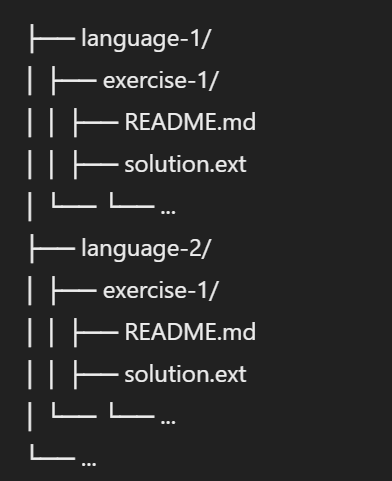

# Exercism Solutions

This repository contains my solutions and study notes for coding exercises from [Exercism](https://exercism.org/).

## Overview

Exercism is a platform that provides coding exercises in various programming languages, designed to help improve coding skills through practice and mentorship. This repository is organized by language, with each directory containing my solutions and any relevant notes or resources.

## Structure

## Languages

Currently, this repository includes exercises for the following languages:
- Python

## Getting Started

To explore my solutions, navigate to the respective language folder and then to the specific exercise folder. Each exercise folder contains:
- `README.md`: Description and instructions for the exercise.
- `solution.ext`: My solution to the exercise in the relevant programming language.
- `test.ext`: My test to the exercise in the relevant programming language.

## Contributions

While this repository primarily serves as my personal study log, I welcome suggestions and improvements. Feel free to open an issue or submit a pull request with enhancements.

## Contact

If you have any questions or would like to discuss any of the exercises, feel free to reach out to me via email.

---

Happy coding!
